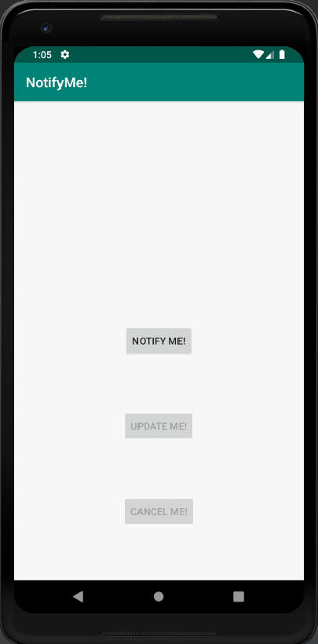
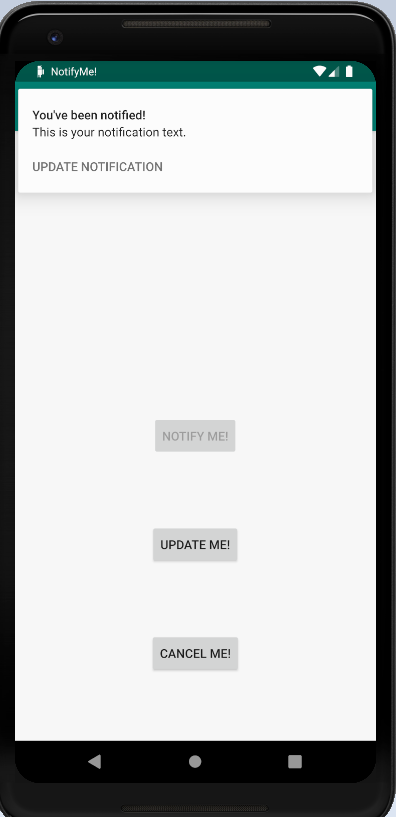
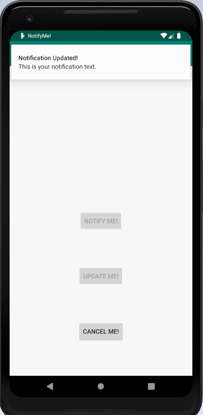

# NotificationsCodelab
Notifications Codelab

Overview file is attached as a word file: NotificationsOverview.docx

Instructions:

- Run the Android project.
- Create a new Virtual Device if not already. Then, choose Pixel 2 XL, then click OK.
- It will load the notifyme project with 3 buttons to notify, update and cancel.

